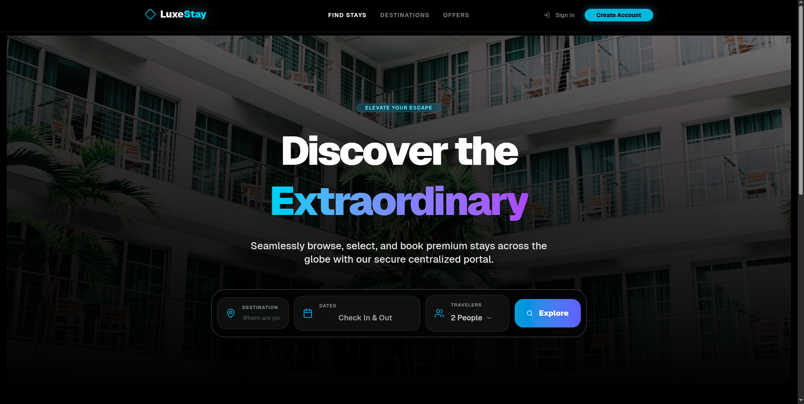
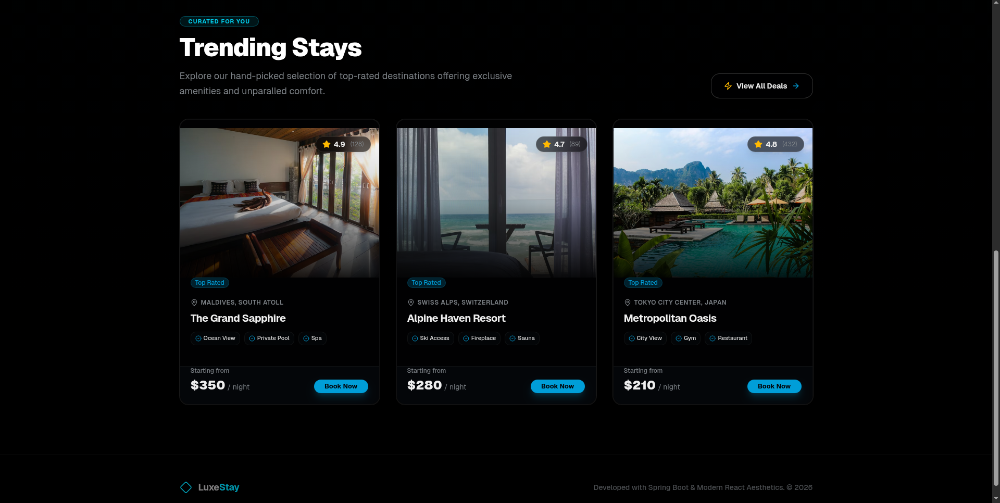
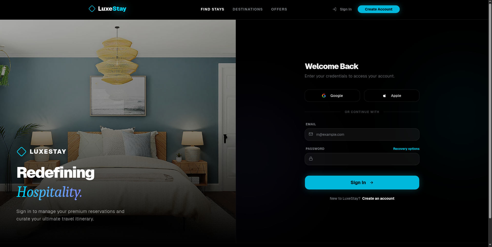
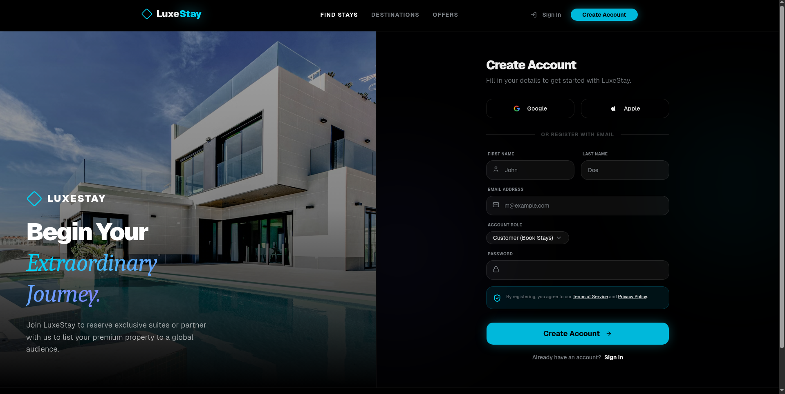
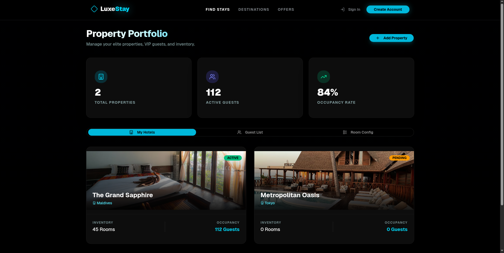
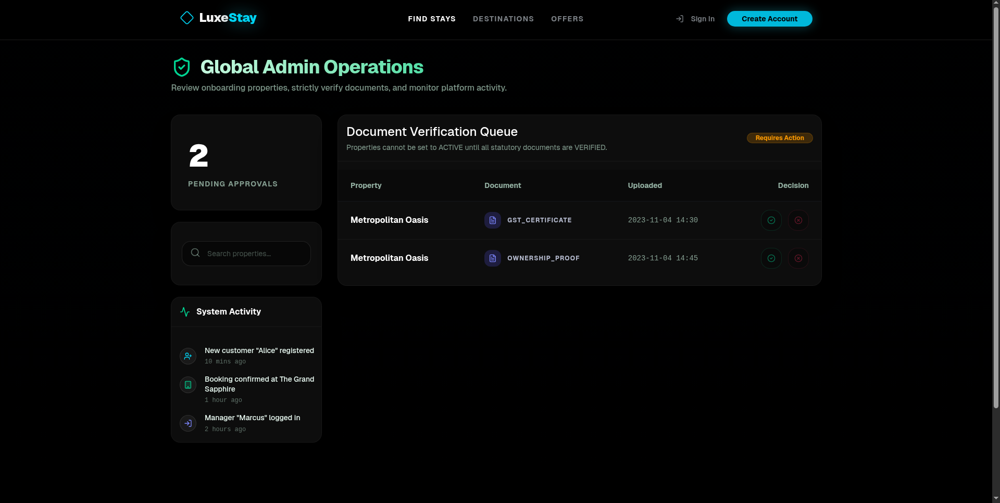

<div align="center">
  
  <h1>LuxeStay Hotel Management System</h1>
</div>

<p align="center">
  <strong>A premium, high-fidelity hotel management prototype built for elegance and performance.</strong>
</p>

---

LuxeStay is a beautifully crafted frontend prototype designed to streamline luxury hospitality operations. It combines a dynamic guest booking funnel with robust, localized administration tools for property managers, leveraging a breathtaking glassmorphic design system and fluid Framer Motion animations.

## 🌟 Elite Features

- **Guest Booking Funnel**: A seamless, frictionless journey from discovering luxury properties to completing reservations via an interactive Checkout Sheet.
- **Split-Screen Authentication**: A stunning, high-contrast visual login/registration experience securing all platform modules.
- **Manager Portfolio**: Empower your property owners. Managers can oversee their personal resort inventories, track guest statuses, and initiate the onboarding of new elite properties.
- **Global Administrator Hub**: A centralized command center featuring a fast-action Document Verification Queue, and real-time System Activity monitoring to ensure platform compliance.

---

## 📸 System Previews

### Customer Exploration & Booking

Seamlessly browse global luxury resorts using optimized search filtering, then review expansive property details before initiating the dynamic checkout procedure.

<div align="center">
  
  
</div>

### Intuitive Onboarding

Security meets art. Users and Managers are welcomed through an immersive aesthetic that dynamically sets the tone for a luxury platform.

<div align="center">
  
  
</div>

### Operations & Control

From localized metrics for individual resort managers, to global oversight queues for platform administrators, the dashboards are engineered for speed and clarity.

<div align="center">
  
  
</div>

---

## 🛠 Tech Stack

LuxeStay is engineered using modern, state-of-the-art frontend tooling to guarantee sub-second interactions and high scalability.

- **Framework**: [React 18](https://react.dev) + [TypeScript](https://www.typescriptlang.org) via [Vite](https://vitejs.dev/)
- **Styling Architecture**: [Tailwind CSS v4](https://tailwindcss.com)
- **Component Primitives**: [shadcn/ui](https://ui.shadcn.com/)
- **Micro-Animations**: [Framer Motion](https://www.framer.com/motion/)
- **Routing Engine**: React Router DOM
- **Iconography**: [Lucide React](https://lucide.dev/)

---

## 🚀 Setup & Local Development

Run the entire LuxeStay frontend interface locally in seconds.

### Prerequisites

- Node.js (v18.0.0 or higher)
- npm or yarn

### Installation Sequence

```bash
# 1. Clone the repository
git clone https://github.com/TeamHcl/HotelManagement.git

# 2. Enter the working directory
cd HotelManagement

# 3. Install dependencies
npm install

# 4. Launch the local development server
npm run dev
```

Visit `http://localhost:5173` to explore the application.

---

## 🎨 Design Philosophy

The user interface isn't just painted on—it's engineered. The aesthetic relies heavily on sophisticated spatial geometry, precision ambient radial illumination (`blur-[150px]`), and deeply translucent glassmorphic components (`bg-white/5 backdrop-blur-xl`). Every interactive element utilizes Framer Motion to guarantee that layout shifts feel responsive and organic rather than abrupt.

## 🔮 Roadmap

Currently, LuxeStay serves as a high-fidelity frontend prototype. The upcoming roadmap features integrating this exact architecture with a deeply unified **Spring Boot REST API** structure that handles user roles, JWT authentication, and SQL relationship mapping for hotels, rooms, and bookings.
